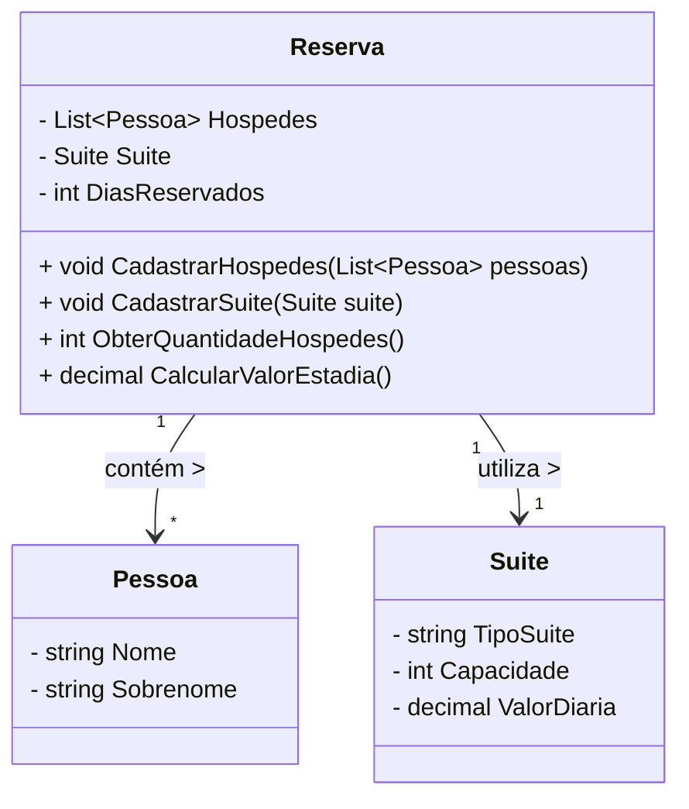

# DIO - BOOTCAMP End to End Engineer (.NET/C#)
> BootCamp realizado na DIO - Digital Innovation One
> GABRIEL GALACCI MALDONADO
> MAIO DE 2025

## Desafio de Projeto - Dados e Listas de .NET/C#: Hospedagem
> Projeto de um Sistema de Hospedagem para ser feito utilizando conhecimento de Dados e Listas utilizando a plataforma .NET e a Linguagem de Programação C#.

## Diagrama das Classes do Projeto Utilizando a Sintaxe Mermaid
